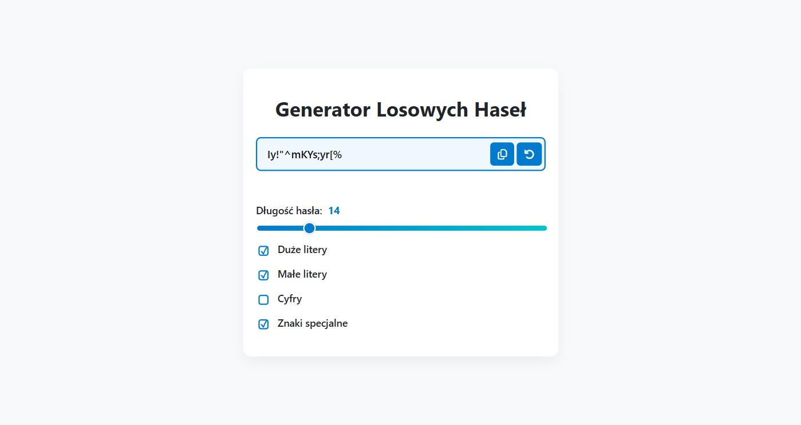
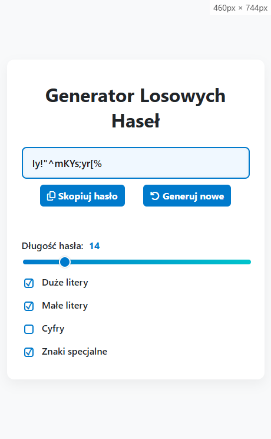

# Generator haseł

Generator haseł, który pomaga szybko stworzyć mocne, unikalne hasło. Użytkownik może dostosować długość hasła i zdecydować, jakie znaki mają zostać uwzględnione. Projekt stworzony w celu ćwiczenia pracy oraz pokazania umiejętności z językiem JavaScript.

## Jak to działa?

Po wejściu na stronę użytkownik może ustawić parametry hasła, takie jak długość oraz rodzaj znaków, które mają się w nim znaleźć. Po kliknięciu odpowiedniego przycisku, aplikacja losowo dobiera znaki zgodnie z wybranymi ustawieniami i wyświetla gotowe hasło gotowe do skopiowania i użycia.

## Funkcje

- Wybór długości hasła z zakresu 4-64 znaków
- Możliwość zaznaczenia, jakie znaki mają być użyte
  - małe litery
  - wielkie litery
  - cyfry
  - znaki specjalne
- Przycisk kopiowania hasła do schowka
- Responsywny design

## Zobacz demo

### Podgląd działania

### Link do testu
[Demo generatora haseł](https://rayskidev.github.io/password-generator/)

## Środowisko testowe

- Opera GX
- Microsoft Edge
- Firefox
- Google Chrome
